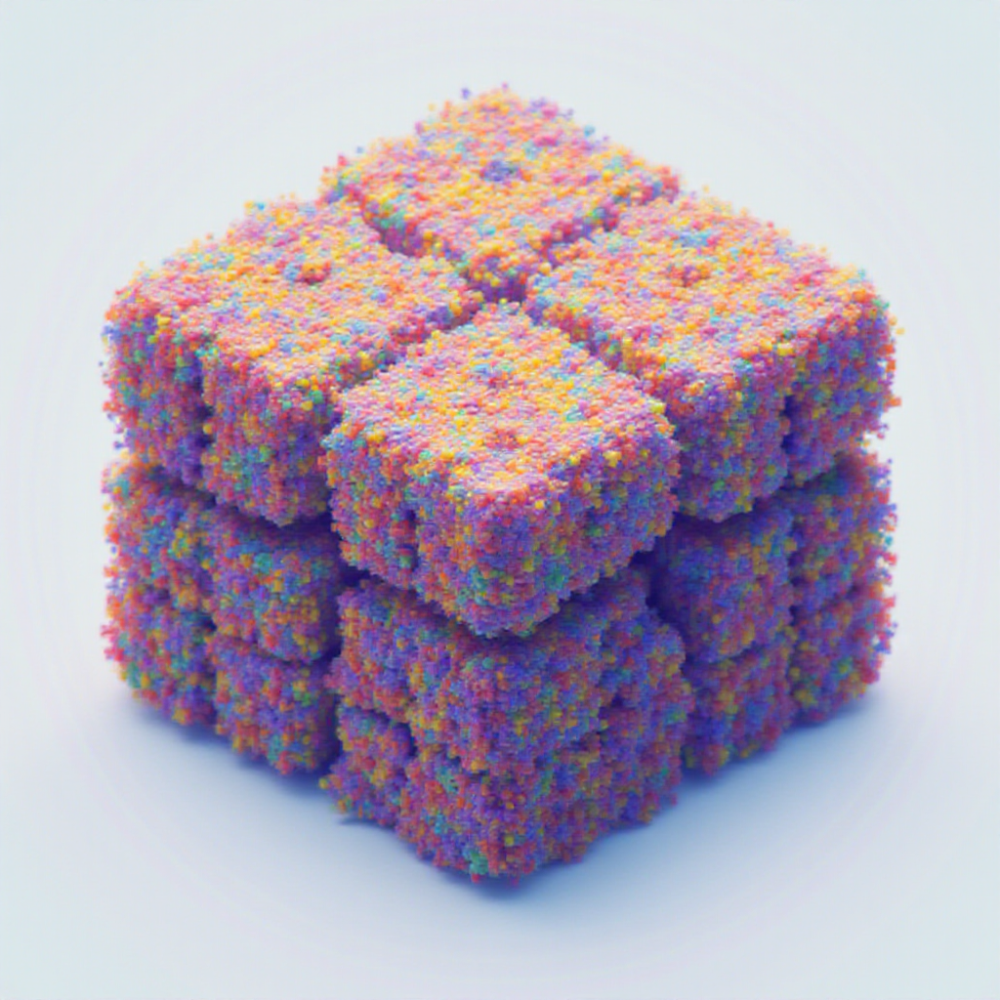
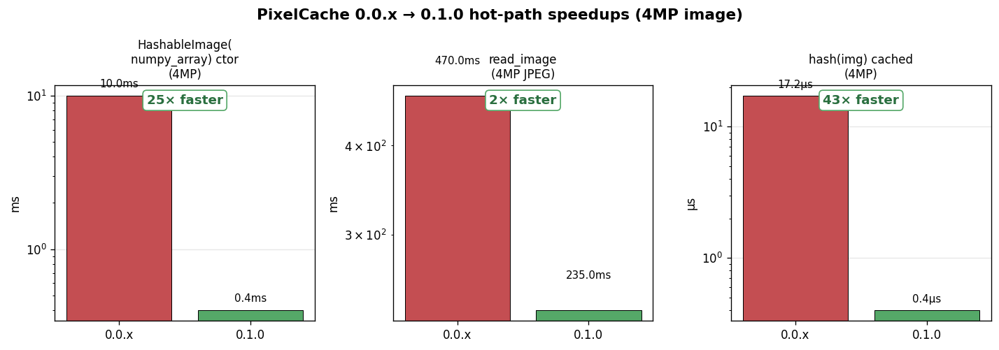
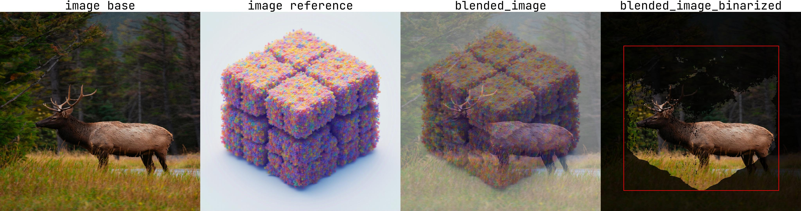
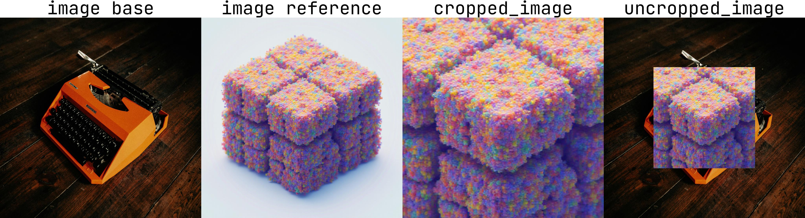

<div align="center">

# PixelCache



**One hashable wrapper for images stored as PIL, NumPy, or PyTorch — convert between them on demand, hash them safely as cache keys, and stop transferring pixel data through disk.**

[](https://pypi.org/project/pixelcache/)
[](https://pypi.org/project/pixelcache/)
[](https://pypi.org/project/pixelcache/)
[](https://github.com/affromero/PixelCache/actions/workflows/tests.yml)
[](https://github.com/affromero/PixelCache/actions/workflows/publish.yml)
[](https://github.com/affromero/PixelCache/blob/main/LICENSE.md)
[](https://github.com/astral-sh/ruff)
[](http://mypy-lang.org/)
[](https://github.com/patrick-kidger/jaxtyping)
[](https://socket.dev)
[](https://github.com/affromero/PixelCache/pulls)

</div>

```
                  ┌──────────────┐
   path / URL ──▶ │              │ ──▶ .pil()           PIL.Image
   bytes      ──▶ │ HashableImage│ ──▶ .numpy()         np.ndarray  (h w 3 | h w)
   ndarray    ──▶ │              │ ──▶ .tensor()        torch.Tensor (1 c h w)
   tensor     ──▶ │  (immutable) │ ──▶ .raw()           native type
   PIL.Image  ──▶ │              │ ──▶ hash(img)        xxhash content fingerprint
                  └──────────────┘
```

Every accessor returns an **independent copy** by default. Need the zero-copy view? Use the explicit `.numpy_view()`, `.tensor_view()`, `.pil_view()`, or `.raw_view()` — and never mutate them.

## What's new in 0.1.0

This is a near-complete rewrite of pixelcache. See [`CHANGELOG.md`](CHANGELOG.md) for the full breakdown.



| Operation                         | 0.0.x                                                  | 0.1.0                                                               |
| --------------------------------- | ------------------------------------------------------ | ------------------------------------------------------------------- |
| `HashableImage(numpy_array)` ctor | `~10 ms` (always wrote a temp PNG to disk)             | `<1 ms` (lazy — only writes on `get_filename()`)                    |
| `read_image(path)`                | Double-decode (EXIF check + actual decode)             | Single-decode (one PIL open or torchvision fast-path)               |
| `hash(img)` (cached)              | `~17 μs` (re-materialized full pixel bytes every call) | `~0.4 μs` (xxhash content fingerprint cached on the instance)       |
| `img.numpy()`                     | Returned the internal buffer (footgun)                 | Returns an independent copy — `numpy_view()` for explicit zero-copy |
| `HashableDict` / `HashableList`   | Mutable, with stale-hash hazards                       | Immutable; deep-copy mutable leaves; read-side leaf protection      |

Plus 12+ correctness bugs fixed (ImageCrop dims, Points axes, PIL-mode handling, `mask2bbox`, `bgr2rgb` torch path, `get_filename` fidelity, …) across 8 rounds of adversarial review.

## What can you build with it?

PixelCache is the glue layer between PIL / NumPy / PyTorch image code that doesn't want to know which one it's holding. Some workflows it makes much simpler:

- **ML inference pipelines** — Hugging Face / diffusion / SAM-style models want torch tensors; preprocessing libs want NumPy; visualization wants PIL. Wrap once at the input boundary; convert at the call site without copying through `Image.fromarray` / `torch.from_numpy` glue.
- **Content-addressed caching** — `@functools.lru_cache` and `@cachetools.cached` need hashable keys. `hash(HashableImage(arr))` is a stable `xxhash` fingerprint of the pixel content, not `id()`, so the same image hits the cache regardless of which path / array / tensor it came in as.
- **Mask-driven crop / paste workflows** — `mask.mask2bbox()` → `image.crop_from_bbox(boxes)` → process → `cropped.uncrop_from_bbox(base, boxes)` lets you run heavy models on the relevant region only, then composite back.
- **Reproducible test fixtures** — feed the same image into `HashableImage` from any source (path, bytes, ndarray, tensor) and you'll get the same content hash. Useful for snapshot tests and regression suites.
- **Annotated debug grids** — `HashableImage.make_image_grid({"label": [img]})` stitches a labeled comparison sheet from a dict of HashableLists. One line. Saves to PNG/JPG.
- **EXIF-correct phone-photo loading** — `HashableImage("IMG_1234.HEIC")` decodes via `pillow-heif`, applies EXIF orientation, and gives you an RGB tensor or array. No more sideways portraits.
- **Bounding box arithmetic** — `BoundingBox(xmin, ymin, xmax, ymax, image_size=...)` carries normalized vs. pixel coords explicitly with `.xyxy` / `.xywh` / `.xyxyn` / `.xywhn`; arithmetic and equality compare by field, not just hash.
- **Hashable params for ML configs** — `HashableDict({"image": img, "prompt": "...", "seed": 42})` makes whole inference configurations content-hashable so you can cache by *what the call looks like*, not by argument identity.

## Installation

```bash
pip install pixelcache
# or
poetry add pixelcache
# or from source
poetry add git+ssh://git@github.com:affromero/pixelcache.git
```

Requires Python ≥ 3.10. Runtime deps: numpy, torch, torchvision, pillow, opencv-python, pydantic, jaxtyping, beartype, xxhash, matplotlib, difflogtest, einops, pillow-heif, rich, tyro.

## Basic Usage

`HashableImage` accepts any of these input types:

| Input                                                                                 | Notes                                                                                                                    |
| ------------------------------------------------------------------------------------- | ------------------------------------------------------------------------------------------------------------------------ |
| `str` / `pathlib.Path`                                                                | Local file or HTTP/HTTPS URL — decoded once via torchvision (fast path for JPEG/PNG) or PIL (everything else, plus HEIC) |
| `bytes`                                                                               | Decoded eagerly, doesn't retain the buffer                                                                               |
| `PIL.Image.Image`                                                                     | RGBA / P / CMYK / YCbCr / LAB inputs normalize to RGB                                                                    |
| `UInt8[np.ndarray, "h w 3"]` / `UInt8[np.ndarray, "h w"]` / `Bool[np.ndarray, "h w"]` | uint8 / bool numpy arrays                                                                                                |
| `Float[torch.Tensor, "1 c h w"]` / `Bool[torch.Tensor, "1 1 h w"]`                    | torch tensors in `[0, 1]`                                                                                                |

```python
import torch
from pixelcache import HashableImage

image = HashableImage(torch.rand(1, 3, 256, 256))
image_pil    = image.pil()              # PIL.Image — safe to mutate
image_np     = image.numpy()            # np.ndarray — safe to mutate
image_t      = image.tensor()           # torch.Tensor — safe to mutate
image_bool   = image.to_binary(0.5)     # → HashableImage in "1" mode

# Zero-copy escape hatches (read-only):
image_np_ro  = image.numpy_view()       # writeable=False
image_t_ro   = image.tensor_view()      # do not mutate
image_pil_ro = image.pil_view()         # do not mutate

# Cache key usage — hash is stable within a process:
cache: dict[HashableImage, str] = {}
cache[image] = "first-seen"
```

### Common transformations

```python
image.resize(ImageSize(height=128, width=128))   # bilinear by default
image.downsample(factor=2)                       # halves both dims
image.rotate(45.0)
image.to_gray()                                  # → "L" mode
image.to_rgb()                                   # → "RGB" mode
image.to_binary(threshold=0.5)                   # → "1" mode
image.equalize_hist()
image.center_pad(ImageSize(height=512, width=512), fill=255)
image.crop_from_bbox(bboxes)
image.save("/path/to/out.png")
```

## Usage Example 1 — Blending

Blending two images and saving an annotated comparison grid:

```python
from pathlib import Path

from difflogtest import get_logger
from pixelcache import HashableDict, HashableImage, HashableList

logger = get_logger()

image0 = "https://images.pexels.com/photos/28811907/pexels-photo-28811907/free-photo-of-majestic-elk-standing-in-forest-clearing.jpeg"
image1 = Path("pixelcache") / "assets" / "pixel_cache.png"

images_hash = [HashableImage(image) for image in [image0, image1]]
for image in images_hash:
    logger.info(f"Image: {image} - Hash: {hash(image)}")
logger.info(f"Hash for list of images: {hash(HashableList(images_hash))}")

image_size = images_hash[1].size()
resized_images = [image.resize(image_size) for image in images_hash]

blended = resized_images[0].blend(resized_images[1], alpha=0.5, with_bbox=False)
blended_bin = resized_images[0].blend(
    resized_images[1].to_binary(0.5).invert_binary(),
    alpha=0.2,
    with_bbox=True,
)

output_debug = HashableDict({
    "image base":              HashableList([resized_images[0]]),
    "image reference":         HashableList([resized_images[1]]),
    "blended_image":           HashableList([blended]),
    "blended_image_binarized": HashableList([blended_bin]),
})
output = image1.parent / f"{image1.stem}_demo_blend.jpg"
HashableImage.make_image_grid(
    output_debug, orientation="horizontal", with_text=True,
).save(output)
logger.success(f"Output saved to: {output}")
```



## Usage Example 2 — Mask → BBox → Crop / Uncrop

Pull a binary mask off a reference image, crop the reference by the mask, then place the crop back onto a base image using `mask2bbox`. Any chain that produces a `HashableImage` in binary `"1"` mode works as the mask input.

```python
from pathlib import Path

from difflogtest import get_logger
from pixelcache import HashableDict, HashableImage, HashableList, ImageSize

logger = get_logger()

image0 = "https://images.pexels.com/photos/18624700/pexels-photo-18624700/free-photo-of-a-vintage-typewriter.jpeg"
image1 = Path("pixelcache") / "assets" / "pixel_cache.png"

images_hash = [HashableImage(image) for image in [image0, image1]]
image_size = images_hash[1].size()
resized_images = [image.resize(image_size) for image in images_hash]

increased_size_pad = ImageSize(
    width=image_size.width + 1000,
    height=image_size.height + 1000,
)
mask = (
    images_hash[1]
    .center_pad(increased_size_pad, fill=255)
    .resize(image_size)
    .to_gray()
    .to_binary(0.3)
)

cropped = resized_images[1].crop_from_mask(mask)
uncropped = cropped.uncrop_from_bbox(
    base=resized_images[0],
    bboxes=mask.mask2bbox(margin=0.0),
    resize=True,
)

output_debug = HashableDict({
    "image base":      HashableList([resized_images[0]]),
    "image reference": HashableList([resized_images[1]]),
    "cropped_image":   HashableList([cropped.resize(image_size)]),
    "uncropped_image": HashableList([uncropped]),
})
output = image1.parent / f"{image1.stem}_demo_cropUncrop.jpg"
HashableImage.make_image_grid(
    output_debug, orientation="horizontal", with_text=True,
).save(output)
logger.success(f"Output saved to: {output}")
```



> Both examples are runnable as-is from `pixelcache/examples/`.

## Project conventions

This project follows [`CLAUDE.md`](CLAUDE.md): jaxtyping shape/dtype annotations on public surfaces, `difflogtest.utils.path` instead of raw `pathlib`, no `Any`/`# noqa`/`# type: ignore` in new code, files under 1000 lines, immutable value types where possible.

## Contributing

Contributions are welcome. Open an issue or submit a pull request — `pre-commit run --all-files` and `pytest tests/` must both pass.

## License

MIT — see [`LICENSE.md`](LICENSE.md).

## You might also like

If you found PixelCache useful, check out some other projects from the same author:

|                                                                 |                                                                 |                   |
| --------------------------------------------------------------- | --------------------------------------------------------------- | ----------------- |
| [**DiffLogTest**](https://github.com/affromero/DiffLogTest)     | Snapshot testing through `print` output comparison              | Python · pytest   |
| [**fairtrail**](https://github.com/affromero/fairtrail)         | Track flight prices over time. Self-hosted. Bring your own LLM. | Next.js · Prisma  |
| [**gitpane**](https://github.com/affromero/gitpane)             | Multi-repo git workspace dashboard for the terminal             | Rust · TUI        |
| [**kin3o**](https://github.com/affromero/kin3o)                 | AI-powered Lottie animation generator CLI                       | TypeScript · LLM  |
| [**pricetoken**](https://github.com/affromero/pricetoken)       | Real-time LLM pricing API · REST + npm + historical data        | TypeScript        |
| [**yazi-ssh.yazi**](https://github.com/affromero/yazi-ssh.yazi) | Browse remote filesystems in yazi over SSH                      | Lua · yazi plugin |
| [**ply2lcc**](https://github.com/affromero/ply2lcc)             | Convert Gaussian Splats in PLY → XGRIDS LCC format              | Python · 3D       |
| [**riasec-co**](https://github.com/affromero/riasec-co)         | Bayesian vocational orientation engine for Colombia             | npm · PyPI · CRAN |
